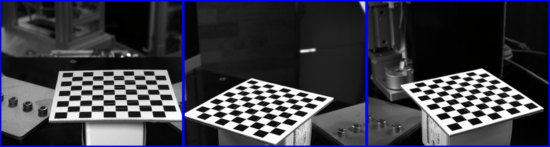
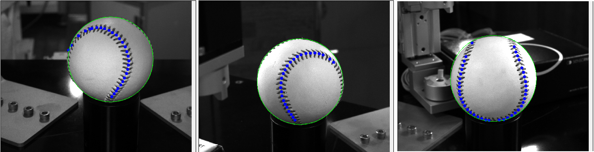
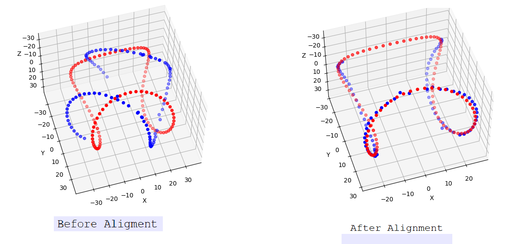

# baseball-alignment


In the world of product customization, precise logo placement on curved surfaces like baseballs presents a unique challenge. To address this, I developed a 3D alignment framework that leverages computer vision techniques and a multi-camera setup to ensure accurate positioning and alignment of logos on baseballs by understanding their orientation in 3D space.

[Watch Demo on YouTube](https://youtube.com/shorts/Gop8vjaT2SM)

## Project Overview
The primary goal of this project is to use three cameras positioned around a stationary baseball to capture and analyze the ball's orientation, then use that information to rotate it to a precise, canonical orientation for logo printing. Here's the step-by-step breakdown of my framework:

1. **Camera Calibration and Coordinate Setup**
2. **2D Ball and Seam Detection**
3. **3D Ball Localization and Orientation Alignment**
4. **Point Cloud Matching for Rotation Calculation**

Each stage builds upon the last, leading to a final calculation of the rotational angles needed for perfect alignment.

---

# Step 1: Camera Calibration and Coordinate Setup

## Camera Calibration
To start, I placed three cameras around the stationary baseball, each capturing different angles. Calibration is crucial for accurate measurements, so I used a standard chessboard pattern to calibrate each camera individually. This process involves:
- Capturing multiple images of the chessboard from each camera.
- Calculating intrinsic parameters (focal length, optical center, etc.) and extrinsic parameters (rotation and translation with respect to world coordinates) from the chessboard points.



This calibration is key to accurately projecting 2D image points into the 3D world.

## World Coordinate Registration
Using the chessboard setup, I aligned the world coordinate system to match a canonical view of the baseball's axis. This setup serves as the reference coordinate system for the rest of the analysis, ensuring that every measurement aligns with this standardized orientation.


---

# Step 2: 2D Ball and Seam Detection

## Detecting the Ball's Circle
Once the cameras are calibrated, the next step is to capture images of the baseball itself. Using OpenCV's `HoughCircles` function, I detected the 2D circle (center and radius) of the ball in each view:
<!-- ```python
circles = cv2.HoughCircles(gray_image, cv2.HOUGH_GRADIENT, dp=1.2, minDist=50, param1=50, param2=30, minRadius=20, maxRadius=30) -->

This detection provides the 2D center coordinates and radius of the ball for each camera, which we’ll use in the 3D calculations.


## Seam Point Detection Using Machine Learning

Identifying the seams on the baseball is essential, as they provide unique markers for orientation. Using a machine learning model trained on baseball seam images, I extracted the seam points in each 2D view, which will serve as input for the 3D alignment process.



---

# Step 3: 3D Ball Localization and Orientation Alignment

## Triangulating the 3D Center and Radius
By using the 2D centers from all three views, along with the cameras’ intrinsic and extrinsic parameters, I triangulated the 3D center of the ball. 

(asset/eq.png)
<!--  -->

Using this formula for each camera, I obtained the 3D radius of the ball. distance_to_ball means distance between 3D ball center and camera position.

## Virtual Sphere Creation
With the 3D center and radius calculated, I created a virtual sphere representing the baseball in 3D space. This sphere serves as the model onto which seam points will be projected for orientation comparison.


# Step 4: Seam Point Cloud Formation and Canonical Comparison

## Projecting Seam Points into 3D
Using the seam points detected in each camera view, I cast pixel rays from the camera through each seam point, checking for intersections with the virtual sphere. This intersection forms a 3D point cloud representing the current orientation of the seams.

To make this point cloud comparable, I shifted it to the origin \((0,0,0)\), aligning it with the standardized world coordinates set in Step 1.

## Generating the Canonical Point Cloud
To establish a reference, I generated a canonical point cloud based on an ideal seam structure, using a parametric equation with the ball’s 3D radius:

$$
x = a \sin t + b \sin 3t, \quad y = a \cos t - b \cos 3t, \quad z = \sqrt{4ab} \cos 2t
$$

where \( a + b = R \) (with \( R \) as the 3D radius). This equation simulates the expected seam pattern for an ideally aligned baseball, giving us a target point cloud.


# Step 5: Point Cloud Matching and Rotation Calculation

## Finding the Rotation Matrix
With both the current and canonical point clouds, the final task is to calculate the rotation needed to align them. Using Open3D’s feature-based point cloud matching, I computed the rotation matrix between the two point clouds. This matrix represents the transformation needed to align the current view with the canonical view:



Red dots represent canonical point clouds and blue dots represent current view point cloud

